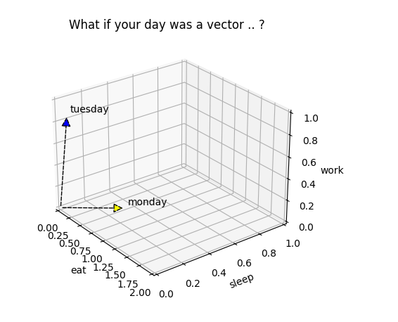

# Life Vectors
 
## Idea:
I want for everyday life to represent each day as vector in n dimensional space where each dimension denotes something awesome like:
* sleeping
* eating 
* working
* learning
* netflix&chilling
* scubadiving
* doing nothing at all
* ...

## Result
People can inspect there daily performance in a geometric way! 
Similar vectors represent similar lifestyles

## Implementation

none yet.